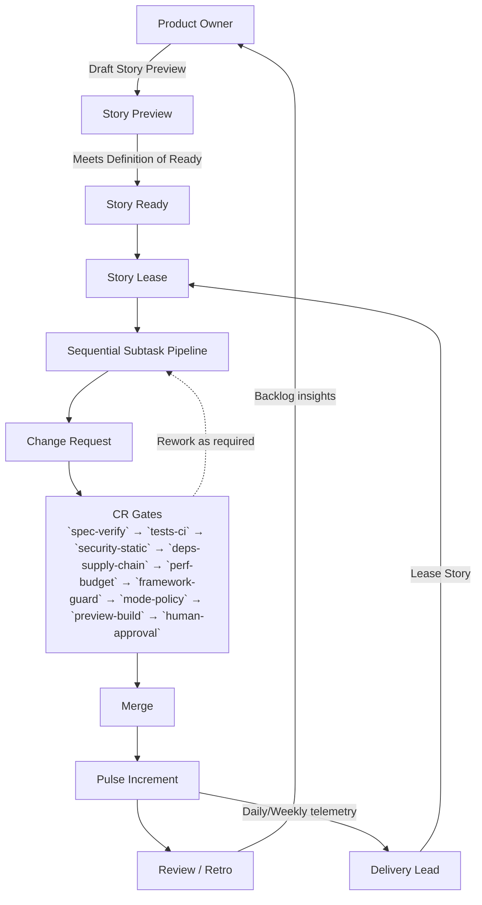

# Agentic Delivery Framework (ADF) — Methodology

**Licensed under CC BY-SA 4.0.**

The Agentic Delivery Framework (ADF) is a vendor-neutral methodology for human + AI teams to ship software safely. It centers three Scrum-friendly accountabilities—**Delivery Lead**, **Product Owner**, and **Developers**—who collaborate through a governed planning and delivery flow. Every change moves through a **Change Request (CR)** with Definition of Done (DoD) and gate evidence so Sprints stay auditable.

> **Latest release:** [ADF v0.6.0](docs/specs/adf-spec-v0.6.0.md) adds spec-driven workflow enforcement, multi-agent SSP handoffs, refreshed gates with the `trust-metrics` kill-switch controls, prompt hygiene safeguards, Delivery Pulse metrics, and compliance/DORA integration guidance. Profiles/Templates here are informative; ADF remains tool-agnostic. v0.5.0 and v0.4.0 remain available for teams on prior specifications.

## Quickstart (one-day adoption)

1. **Read the spec:** Start with the [ADF v0.6.0 specification](docs/specs/adf-spec-v0.6.0.md) for normative requirements.
2. **Follow the handbook:** Use the [handbook index](docs/handbook/README.md) for step-by-step SSP, Story Preview, Pulse, evidence, and safety rail guidance.
3. **Apply templates:** Copy-paste [PR and Story Preview templates](docs/templates/) plus the [conformance checklist](docs/templates/conformance-checklist.md).
4. **Configure platform:** Mirror the [GitHub profile](docs/profiles/github.md) and accompanying [examples](docs/examples/github/) to map gates, protections, and labels.
5. **Track upgrades:** Review the [CHANGELOG](CHANGELOG.md) for upgrade notes from v0.4.0.

## Method framing

- **Scrum-compatible core:** Preserve Scrum roles, events, and artifacts so Delivery Leads, Product Owners, and Developers operate within a familiar cadence.
- **Extension practices:** Layer CR-first governance, CR gates, Story Previews, Evidence Bundles, and the Delivery Pulse to "light-purify" execution without adding new ceremonies.
- **Agent safety rails:** Apply SSP sequencing, workspace runtime guardrails, and telemetry so human and AI contributors stay conflict-free.

**Normative rule:** **SSP is required** for all ADF teams. It is a core practice that enables safe, conflict-free agent execution.

## Conformance levels (L1–L3) — SSP is required
- **L1 – Supervised Agents:** Agents may propose/commit changes under human oversight. **SSP required** (exclusive Story lease, ordered subtasks, one CR). **CR gates required.** Daily Pulse required.
- **L2 – Autonomy-Guarded:** Agents can execute outside working hours. **SSP required** with stricter lease timeouts and checkpoint criteria; **CR gates required** with expanded policy set (security, secrets, perf). Daily Pulse required.
- **L3 – Autonomy-First (24/7):** Agents primarily drive delivery. **SSP required** with hard lease enforcement, rollback/escape-hatch policy; **CR gates required** as policy-as-code; human approval only for risk-tagged changes. Daily Pulse required.

## Few simple rules
- **CR-first:** Every code or content change merges via a Change Request targeting a single Story branch.
- **DoD + CR gates:** `spec-verify`, `tests-ci`, `security-static`, `deps-supply-chain`, `perf-budget`, `framework-guard`, `mode-policy`, `preview-build`, and `human-approval` must pass before merge. Apply `break-glass` only with CAPA follow-up.
- **Sequential Subtask Pipeline (SSP):** Decompose Stories into ordered subtasks with an exclusive Story Lease, per-subtask checkpoints, and a single CR once green.
- **Daily Pulse Increment:** Produce a demoable artifact of merged, green work ahead of the Delivery Pulse and retain 14 days.
- **Make it inspectable:** Story Previews, Evidence Bundles, Pulse reports, and telemetry stay visible to humans and agents.

> **Delivery Pulse** combines an automated overnight run with a 10–15 minute human sync to inspect progress, surface risks, and agree on next actions using the latest **Pulse Increment**.

## Core vocabulary
- **Delivery Lead** – steers flow outside the workspace runtime; facilitates Sprint events, enforces WIP limits, and upholds CR gates.
- **Product Owner** – maintains the Product Backlog and Product Goal; partners on Story Previews and Sprint Review outcomes.
- **Developers** – plan, build, and verify increments inside the governed workspace runtime (Humans / AI / Hybrid pairs).
- **Artifacts** – Product Backlog, Sprint Backlog, Increment, **Story Preview**, **Pulse Increment**, **Evidence Bundle**.
- **Events** – Sprint (aka Iteration), Sprint Planning, Delivery Pulse, Sprint Review, Sprint Retrospective, Backlog Refinement.

## Specification & guidance
- **Specifications:** [ADF v0.6.0 (current)](docs/specs/adf-spec-v0.6.0.md), historical [ADF v0.5.0](docs/specs/adf-spec-v0.5.0.md), [ADF v0.4.0](docs/specs/spec.v0.4.0.md), [Specification changelog](docs/specs/changelog.md).
- **Roadmaps:** [Roadmap: 24×7 Autonomous Delivery](docs/roadmaps/adf-roadmap-autonomous-delivery.md).
- **Guiding principle:** Autonomy-with-Accountability → [docs/vision/autonomy-principle.md](docs/vision/autonomy-principle.md).
- **Handbook:** [ADF Handbook index (v0.6.0 aligned)](docs/handbook/README.md) with focused guides for [SSP](docs/handbook/ssp.md), [CR gates](docs/handbook/cr-gates.md), [Story Preview](docs/handbook/story-preview.md), [Pulse Increment](docs/handbook/pulse-increment.md), [Conformance](docs/handbook/conformance.md), [Evidence Bundle](docs/handbook/evidence-bundle.md), [Metrics](docs/handbook/metrics.md), and [Agent safety rails](docs/handbook/safety-rails.md).
- **Templates:** [PR template](docs/templates/pr-template.md), [Story Preview template](docs/templates/story-preview.md), [Labels](docs/templates/labels.md), [CODEOWNERS example](docs/templates/codeowners.example), [Conformance checklist](docs/templates/conformance-checklist.md), legacy [CR checklist](docs/templates/cr-checklist.md).
- **Profiles & examples:** [Profiles overview](docs/profiles/overview.md), [GitHub profile](docs/profiles/github.md), [GitHub examples](docs/examples/github/).
- **Diagrams:** [ADF method overview](docs/diagrams/adf-method-overview.mmd), [SSP flow](docs/diagrams/ssp-flow.mmd), [Pulse increment](docs/diagrams/pulse-increment.mmd), plus neutral diagrams in `docs/diagrams/`.
- **Legacy references:** [Conformance levels (pre-v0.5)](docs/conformance.md), [Method SSP design](docs/method/ssp-sequential-subtask-pipeline.v0.1.0.md), [Guide handbook](docs/guide/handbook.md).
- **Appendices:**
  - [Enterprise mapping: Evidence ↔ SOC2/ISO, metrics ↔ DORA, CAB-lite policy](docs/specs/appendix-enterprise-mapping.md).

**Onboarding & Profiles**
- [Onboarding (Scrum)](docs/handbook/onboarding-scrum.md)
- [Onboarding (Kanban)](docs/handbook/onboarding-kanban.md)
- [Profiles contract](docs/profiles/contract.md)

## Method diagram

High-level SSP governance flow:

See [ADF method — detailed diagram](docs/diagrams/adf-method-detailed.mmd) for the full gate-level feedback loops.

## What’s inside
- `AGENTS.md` – modality charter and guardrails for Delivery Lead, Product Owner, and Developers.
- `docs/overview.md` – consolidated problem statement, vision, goals, and roadmap with Story Preview and Pulse Increment focus.
- `docs/specs/` – specifications (v0.6.0 current, v0.5.0 and v0.4.0 historical) plus changelog history.
- `docs/handbook/` – operational guides for SSP, gates, Story Preview, Pulse, conformance, evidence, metrics, and agent safety.
- `docs/templates/` – PR/Story Preview templates, labels, CODEOWNERS example, conformance checklist, and legacy CR checklist.
- `docs/profiles/` – platform profiles (GitHub profile refreshed for v0.6.0) plus archival diagrams.
- `docs/examples/github/` – illustrative GitHub snippets for required checks, labels, PR template, and repository settings walkthrough.
- `docs/diagrams/` – Mermaid diagrams for method overview, SSP, Pulse, and neutral flows.
- `docs/adrs/` – architectural decisions and vocabulary history.
- `docs/prompts/` – initial operator prompt for neutral methodology adoption.

## Governance & contribution
- [Governance](docs/governance.md) – editors, decision process, and release cadence.
- [Contributing](docs/contributing.md) – propose changes via change requests and RFCs.
- [RFC Process](docs/rfcs/process.md) – submit RFCs using the provided template.
- [Trademarks](TRADEMARKS.md) – usage guidelines for the Agentic Delivery Framework name and marks.

## Policies & legal
- [LICENSE](LICENSE) – Creative Commons Attribution-ShareAlike 4.0 International.
- [NOTICE](NOTICE) – scope of licensed artifacts and reference implementations.
- [TRADEMARKS](TRADEMARKS.md) – non-endorsement and quality requirements for mark usage.

## Status
Documentation scaffold for the vendor-neutral methodology. Platform-specific implementations live in companion repositories and profiles; use the GitHub profile for the example configuration stack.

## Documentation site (informative)
- The `website/` directory hosts the Docusaurus-powered informative site that mirrors the normative specs in `docs/`.
- Install Node.js 18.17 or newer and run `npm install` inside `website/` to prepare local builds.
- Use `npm run start` for local previews, `npm run build` for static output, and `npm run serve` to inspect the generated `website/build/` directory.

---

This work is licensed under CC BY-SA 4.0.
