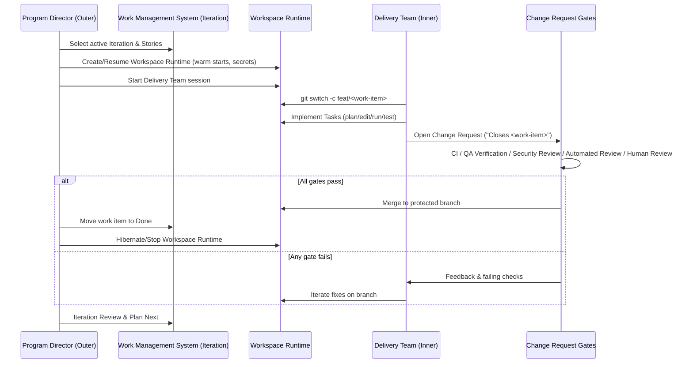

# ADR 0001: Dual-Loop Architecture (Program Director + Delivery Team)

> Status: Accepted — superseded terms retained historically; see spec v0.2.1 for neutral nomenclature.
> Also Known As: formerly Agentic-Agile dual-loop (Outer Orchestrator / Inner Dev Agents).

## Context

Repository renamed from `airnub/agentic-agile` to `airnub/agentic-delivery-framework` (docs-only update; no behavioral changes).

We need safe, auditable agentic development that maps onto ADF Iterations and keeps all execution inside a governed workspace runtime while aligning with enterprise governance.

## Decision

Adopt a **dual-loop** architecture:

- **Program Director** (product/program layer) outside the workspace runtime controls Iterations, selects Stories/Epics, manages the workspace runtime lifecycle, and applies change request governance.
- **Delivery Team** (engineering layer) runs inside the workspace runtime and implements Stories via change requests under strict gates.

## Diagrams
- Historical diagrams: [Mermaid overview flow (GitHub-centric)](../diagrams/adf-overview-flow.mmd), [Mermaid dual-loop sequence (GitHub-centric)](../diagrams/adf-sequence.mmd).
- Neutral diagrams: [Mermaid overview flow](../diagrams/adf-overview-neutral.mmd), [Mermaid dual-loop sequence](../diagrams/adf-sequence-neutral.mmd).

_Figure: Sequence diagram documents the Program Director ↔ Delivery Team interactions and review gates using neutral terminology._

## Alternatives Considered

- **Managed cloud agents** (single-vendor IDEs or hosted sandboxes): faster to start, but limited environment control, portability, and alignment with enterprise governance.
- **Local developer machines**: unsafe and non-reproducible for autonomous edits.
- **Single big agent run (waterfall)**: poor feedback loops; hard to govern.

## Consequences

- **Pros**: safety (no unmanaged edits), governance through change request gates, model choice via open APIs, reproducible environments, enterprise naming alignment.
- **Cons**: we own orchestration costs (workspace runtime minutes, warm starts, secrets). Mitigate with idle shutdowns, budgets, and telemetry per [Conformance L3](../CONFORMANCE.md).

This methodology/spec is licensed under CC BY-SA 4.0.
