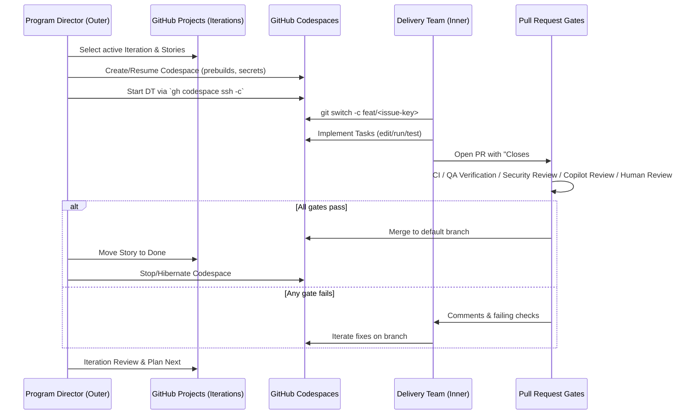

# ADR 0001: Dual-Loop Architecture (Program Director + Delivery Team)

> Also Known As: formerly Agentic-Agile dual-loop (Outer Orchestrator / Inner Dev Agents).

## Context

> Repository renamed from `airnub/agentic-agile` to `airnub/agentic-delivery-framework` (docs-only update; no behavioral changes).

We need safe, auditable agentic development that maps onto ADF Iterations and keeps all
execution inside GitHub’s ecosystem (existing NDAs, org policies, and audit).

## Decision

Adopt a **dual-loop** architecture:

- **Program Director** (product/program layer) outside Codespaces controls Iterations,
  selects Stories/Epics, manages Codespaces lifecycle, and applies PR governance.
- **Delivery Team** (engineering layer) runs inside Codespaces and implements Stories via
  PRs under strict gates.

## Diagrams
- [Mermaid overview flow](../diagrams/adf-overview-flow.mmd)
- [Mermaid dual-loop sequence](../diagrams/adf-sequence.mmd)

_Figure: Sequence diagram documents the Program Director ↔ Delivery Team interactions and review gates (formerly Agentic-Agile dual-loop)._

## Alternatives Considered

- **Managed cloud agents** (OpenAI Codex, Anthropic Computer Use, Google/Gemini IDEs):
  faster to start, but limited container control, portability, and alignment with GitHub
  governance.
- **Local developer machines**: unsafe and non-reproducible for autonomous edits.
- **Single big agent run (waterfall)**: poor feedback loops; hard to govern.

## Consequences

- **Pros**: safety (no local edits), GitHub-native governance, model choice via GitHub
  Models, reproducible envs, enterprise naming alignment.
- **Cons**: we own orchestration (Codespaces minutes, prebuilds, secrets, costs). We
  mitigate with prebuilds, idle shutdowns, and budgets.
