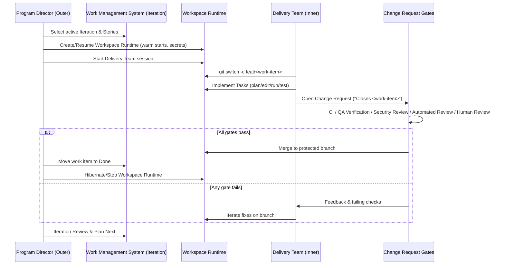

# Vision

Build a **safe, vendor-neutral Agentic Delivery Framework (ADF)** that:
- Treats **ADF Iterations** (Sprint/Cycle) as the primary unit of planning and execution.
- Runs **all code changes inside a managed workspace runtime**, never on unmanaged developer laptops.
- Uses **change request-first governance** with automated and human review gates.
- Stays **model-agnostic** by calling industry LLMs (OpenAI/Anthropic/Google/etc.).
- Scales from solo repos to multi-team programs while remaining auditable and compliant.

The end state: a repeatable two-loop system where product intent (Epics/Stories) flows into a ready workspace runtime, the Delivery Team ships increments under transparent gates, and the Program Director plans the next Iteration from observed outcomes. Neutral terminology keeps directors, PMO, and engineering aligned without vendor lock-in while allowing profiles to map into specific platforms.

## Dual-Loop Overview

Embedding the sequence clarifies how enterprise teams de-risk autonomous edits: the Program Director controls environments and work intake while the Delivery Team ships inside governed workspace runtimes with explicit change request gates.

_Figure: Sequence diagram traces the outer Program Director loop and inner Delivery Team loop with neutral terminology. Formerly Agentic-Agile dual-loop._
