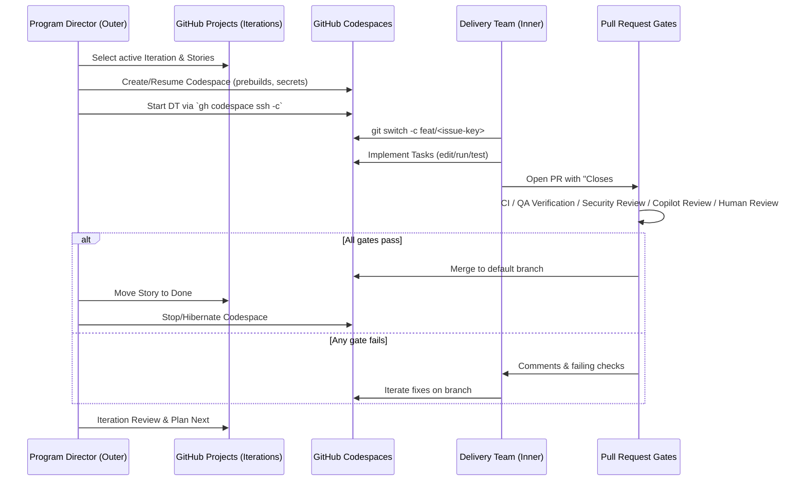

# Vision

Build a **safe, GitHub‑native Agentic Delivery Framework (ADF)** that:
- Treats **ADF Iterations** (Sprint/Cycle) as the primary unit of planning and execution.
- Runs **all code changes inside Codespaces**, never on developer laptops.
- Uses **PR-first governance** with automated and human review.
- Stays **model-agnostic** by calling **GitHub Models** (OpenAI/Anthropic/Google).
- Scales from solo repos to multi-team programs while remaining auditable.

The end state: a repeatable two-loop system where product intent (Epics/Stories) flows into a fresh, prebuilt Codespace, the Delivery Team ships increments under strong gates, and the Program Director plans the next Iteration from observed outcomes. The enterprise-friendly ADF naming keeps directors, PMO, and engineering aligned without methodology lock-in.

## Dual-Loop Overview

Embedding the sequence clarifies how enterprise teams de-risk autonomous edits: the Program Director controls environments and work intake while the Delivery Team ships inside governed Codespaces with explicit PR gates.

_Figure: Sequence diagram traces the outer Program Director loop and inner Delivery Team loop to show governance touchpoints. Formerly Agentic-Agile dual-loop._

